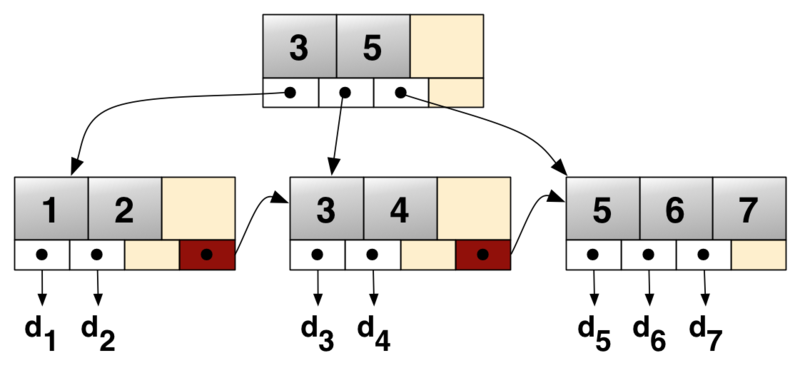

## 面试常见问题

1. mysql 索引使用的什么数据结构？
2. 为什么选择B+树？

### mysql 索引使用的什么数据结构？
准确说，mysql默认的存储引擎 InnoDB使用的是B+树

### 为什么选择B+树？

这个问题就可以深入慢细品了，我看了比较多资料，从我理解的角度一点点拆解。

#### 为什么B+树，而不是平衡二叉树，红黑树？
单纯从性能速度上看，平衡二叉树（这里暂时不展开各种数据结构）查找效率高于B+树。为什么不用了？

核心原因是受限于磁盘i/o读取速度。mysql一般用于存储比较大的数据，使用的都是机械硬盘。机械硬盘一次数据读取的时间是毫秒级的，和内存读取远远不在一个量级。
如果使用二叉树这种多层级结构，会导致磁盘的多次读取，每读取下一层数据，都是一次磁盘重新寻址。
所以B树，B+树 这种多叉树的优势有体现出来了。一个4层的B+树，基本能覆盖上亿数据的查找。

#### 为什么不用B树

先直观看看区别：
B+树

B树

注意了，从图中看主要区别：
1. B+树 图中的3和5 也在叶子节点中，而B树7和16不在叶子节点
2. B+树，非叶子节点，只有指针信息，索引信息都在叶子节点，而B树的索引信息叶子节点和非叶子节点都有。
3. B+树查找3时，需要2次磁盘i/o ,B树查找7，只需要一次磁盘i/o

再来回答问题：

B+ 不是比B树好，所以多个+，其实B树是mongodb的底层数据结构。
为什么选B+树，是应用使用场景更加满足mysql这种数据库。

先按照我的理解回复这个问题：

我认为最关键的是因为mysql场景里，有很多例如: score > 90 and score< 120 范围查询。
而B+树这种数据结构能更好满足这种范围查询输出。

而mongodb是文档型数据库，理论上，单个节点的查找，B树性能可能要高于B+

#### B和B+树核心区别
B+跟B树不同B+树的非叶子节点不保存关键字记录的指针，只进行数据索引，这样使得B+树每个非叶子节点所能保存的关键字大大增加；

B+树的信息全部在叶子节点上，非叶子节点都是指针信息。
B树的中间节点会存数据信息。
在查找时，B+树每次都需要查询到叶子节点，B树可能第一层查询到就结束了。这个也就是为什么说查找单个节点，B+树查询会更稳定，B树查询可能会更快的原因。

#### B和B+树的查询性能
B+ 树的中间节点不含有实际数据，只有子树的最大数据和子树指针，因此磁盘页中可以容纳更多节点元素。但是每次必须查询到叶子节点。

B树，不用每次查询到叶子节点，所以少几次磁盘的i/o 

所以没有最好的数据结构，只有最适合的场景。
