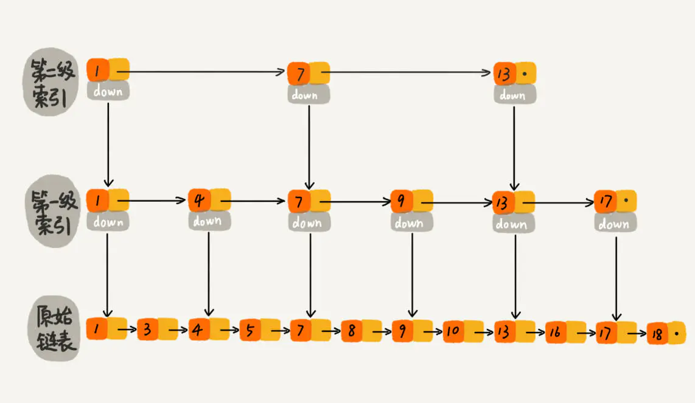

列举下面的数据结构前，先简单了解些，几个数据结构适用的一些场景。

适合快速查找，插入:
散列表，平衡二叉查找树，跳表，B+

适合区间查找：
跳表（底层双向链表），[B+](http://doc.tangguangyao.cn/project-5/doc-14/)(底层是链表)

## 1 string
这个是使用最常见的。经常用来最缓存使用。

## 2 list
列表这种数据类型支持存储一组数据。

*注意*:  不要把List当做列表使用，仅当做队列来使用

底层实现

### 2.1 压缩列表（ziplist）
当列表中存储的数据量比较小的时候，使用压缩列表实现。类似数组，通过一片连续的内存空间，来存储数据。
它并不是基础数据结构，而是 Redis 自己设计的一种数据存储结构。它有点儿类似数组，通过一片连续的内存空间，来存储数据。

### 2.2 双向循环链表
当列表中存储的数据量比较大的时候，就是双向循环链表方式。

> 列表中保存的单个数据（有可能是字符串类型的）大于 64 字节；

> 列表中数据个数多于 512 个。

## 3 hash
字典类型用来存储一组数据对。每个数据对又包含键值两部分。

字典类型也有两种实现方式。

### 3.1 压缩列表
存储的数据量比较小的情况下，用这种数据结构

> 字典中保存的键和值的大小都要小于 64 字节；

> 字典中键值对的个数要小于 512 个。

###3.2 散列表。
哈希函数: MurmurHash2

哈希冲突问题，Redis 使用链表法来解决。

Redis 还支持散列表的动态扩容、缩容：

当装载因子大于 1 的时候，Redis 会触发扩容，将散列表扩大为原来大小的 2 倍左右

当数据动态减少之后，为了节省内存，当装载因子小于 0.1 的时候，Redis 就会触发缩容，缩小为字典中数据个数的大约 2 倍大小

redis使用动态方式避免了大量数据一次性搬移导致的服务停顿。

## 4 set
集合这种数据类型用来存储一组不重复的数据。
两种实现方法

### 4.1 序数组
> 存储的数据都是整数；
> 存储的数据元素个数不超过 512 个。

### 4.2 散列表

## 5 sortedset
有序集合这种数据类型

### 5.1 压缩列表

> 所有数据的大小都要小于 64 字节；
*元素个数要小于 128 个。*

### 5.2 跳表
为什么用跳表而不用红黑树？
跳表可以支持快速的插入、删除、查找操作。
下面是一个跳表数据结构的图。

跳表是把链表升级后改造成类似能“二分”的查找算法。

详细跳表的数据结构，大家可以google下。

跳表可参考:https://lotabout.me/2018/skip-list/ 
