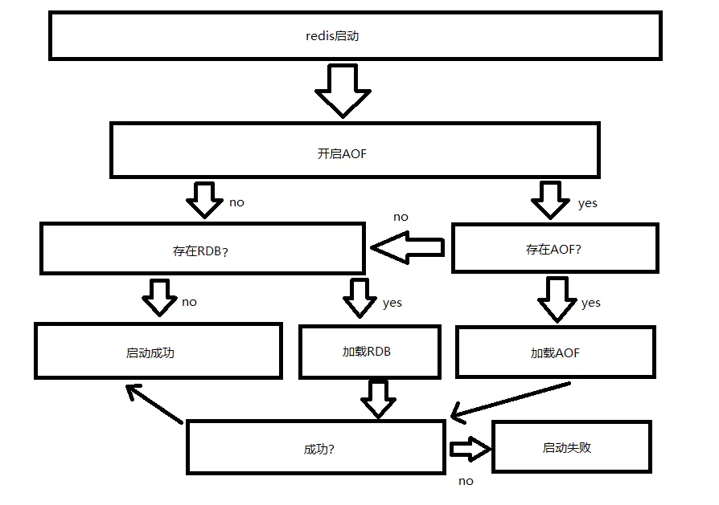

## 1 RDB（快照）
RDB是以一种镜像的方式，持久化redis内容到磁盘。
保存的过程中会有大量的I/O操作，性能有影响

### save
阻塞的方式去持久化镜像（不推荐）。

### BGSAVE
非阻塞，系统会启动一个子进程去处理。

### 配置
redis.conf
```
save  60 100 
```
会让Redis每60秒检查一次数据变更情况，如果发生了100次或以上的数据变更，则进行RDB快照保存。

可以配置多条save指令，让Redis执行多级的快照保存策略。
Redis默认开启RDB快照，默认的RDB策略如下：

底层使用的是BGSAVE

## 2 AOF（日志）
日志的方式，类似mysql的binlog。独立日志的方式记录每次写命令。

AOF不仅仅是用在持久化上，在redis的主从同步上，也是利用了AOF去实现的。

AOF功能需要设置配置：
```
appendonly yes
```

## 3 重启恢复数据
流程图



## 4 常用持久化方式

BGSAVE 定期保存镜像+AOF保存增量

因为在恢复数据时，镜像的速度要远远快于AOF的方式。
