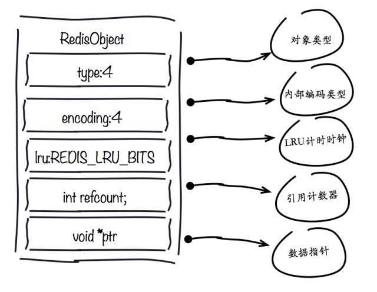

## redisObject对象
内部结构如下图所示



Redis存储的数据都使用redisObject来封装，包括string,hash,list,set,zset在内的所有数据类型。理解redisObject对内存优化非常有帮助，下面针对每个字段做详细说明：

### 1.type字段:
表示当前对象使用的数据类型，Redis主要支持5种数据类型:string,hash,list,set,zset。可以使用type {key}命令查看对象所属类型，type命令返回的是值对象类型，键都是string类型。

### 2.encoding字段:
表示Redis内部编码类型，encoding在Redis内部使用，代表当前对象内部采用哪种数据结构实现。理解Redis内部编码方式对于优化内存非常重要 ，同一个对象采用不同的编码实现内存占用存在明显差异，具体细节见之后编码优化部分。

### 3.lru字段:
记录对象最后一次被访问的时间，当配置了 maxmemory和maxmemory-policy=volatile-lru | allkeys-lru 时， 用于辅助LRU算法删除键数据。可以使用object idletime {key}命令在不更新lru字段情况下查看当前键的空闲时间。

可以使用
```
scan + object idletime  
```
命令批量查询哪些键长时间未被访问，找出长时间不访问的键进行清理降低内存占用。

### 4.refcount字段:

记录当前对象被引用的次数，用于通过引用次数回收内存，当refcount=0时，可以安全回收当前对象空间。

使用object refcount {key}获取当前对象引用。当对象为整数且范围在[0-9999]时，Redis可以使用共享对象的方式来节省内存。具体细节见之后共享对象池部分。

### 5. \*ptr字段:

与对象的数据内容相关，如果是整数直接存储数据，否则表示指向数据的指针。

Redis在3.0之后对值对象是字符串且长度<=39字节的数据，内部编码为embstr类型，字符串sds和redisObject一起分配，从而只要一次内存操作。

高并发写入场景中，在条件允许的情况下建议字符串长度控制在39字节以内，减少创建redisObject内存分配次数从而提高性能。

