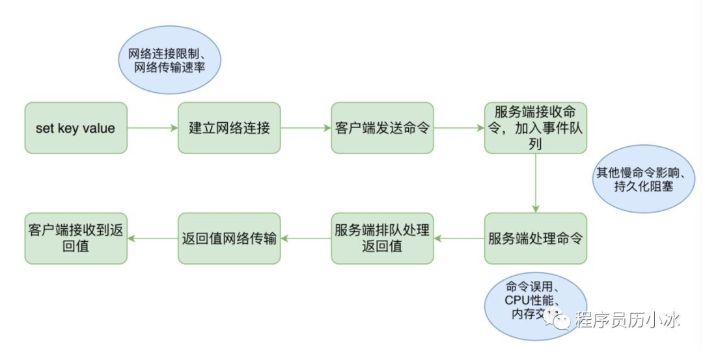

Redis 快很正常，同机房内网访问，利用连接池。
请求耗时不到1ms，慢也就是2ms。

快很正常，耗时10ms,100ms反而不正常了，达到100ms就是属于比较异常了，需要开始关注排查原因了。

看看平常可能会导致慢的问题。

# 命令执行过程




绿色的是执行步骤，而蓝色的则是可能出现的导致高延迟的原因

 服务端常见:
> 网络连接限制
网络传输速率
CPU性能

 Redis独有:
>  命令
 数据结构误用
 持久化阻塞
 内存交换

Redis 还有一个特点，就是他的单线程，因为是单线程，所有客服端发来的请求，都是放到一个执行队列中。redis是串行的处理完一个后继续处理下一个。所有一个任务导致阻塞，就会阻塞住队列，导致后面任务无法进行。

所有大家可以看看上一篇中，因为巨大的value字符串，导致整个实例被卡主。

## 不合理的使用命令
例如:线上实例执行keys 命令，这个如果线上key很多，会导致服务卡主。这种情况应该是使用scan 命令。
sacn 命令是每次少量的获取。

这个知识点其实可以稍微展开下，因为也是我自己犯过的错误，所以印象比较深。
keys 和 scan 这对组合就像shell 的 cat 和 less。

经历是这样的，一次用户报线上问题，为了查这个问题，我就登录了线上服务器。查线上日志（当天的日志还没有收集，所以粗暴的直接查线上机器）。
日志普片格式都是按照小时区分，例如log.2018091201。
我为了图快，直接粗暴的进行了下面操作。
```
cat log.20180912* | grep hello
```
然后就收到了报警。。。

为啥，因为 `cat` 是一次性粗暴的读取一天的日志到内存，那一瞬间，服务器 I/O 直接打满，影响了整个服务器上部署的服务。虽然是轻微的抖动。但是这次也是令我印象深刻。

而 `less` 就是在大文件下替换`cat` 最合适的命令，他也是一次读少量，分片读取。

除了redis，其他任何框架，都是需要注意这种 `cat` 类型的操作。


##  持久化操作
如`cat`， SAVE 命令保存镜像，也是粗暴的阻塞操作。会卡主redis.
应该使用BGSAVE，他是启动一个子进程，不阻塞的操作。

AOF刷盘：
> 文件刷盘的方式一般采用每秒一次，后 台线程每秒对AOF文件做 fsync 操作。当硬盘压力过大时，fsync 操作需要等待，直到写入完成。如果主线程发现距离上一次的 fsync 成功超过2秒，为了数据安全性它会阻塞直到后台线程执行 fsync 操作完成

## 内存交换
如果操作系统把 Redis 使用的部分内存换出到硬盘，由于内存与硬盘读写速度差几个数量级，会导致发生交换后的 Redis 性能急剧下降

## 存储大字符串
这个是我自己经验补充的。在高并发下，大数据量情况下，存储巨大的字符串，也会导致性能变差。具体例子可以看上一篇。


及时上面都注意了，我还遇到一种情况导致高延迟，下一篇慢慢展开。
